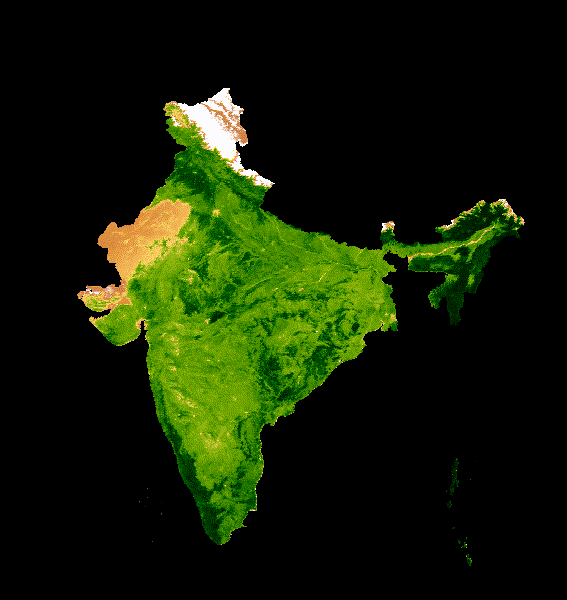

# First Visualization and Analysis in GEE
For this lab, we followed a tutorial that used [MODIS](https://modis.gsfc.nasa.gov/) (Moderate Resolution Imaging Spectroradiometer) and [NDVI](https://en.wikipedia.org/wiki/Normalized_difference_vegetation_index) ( Normalized Difference Vegetation Index) which is a remote sensing indicator on the presence of green vegetation. This was the first time that I had the opportunity to do some remote sensing work and code on Javascript, and some parts of it were more challenging than the rest. The end product was an animated GIF representing 20-year median NDVI for serial 16-day MODIS composites spanning January 1st through December 31st from 2009-2019, for India.
In this tutorial, you'll learn how to generate an animated GIF representing 20-year median NDVI for serial 16-day MODIS composites spanning January 1st through December 31st. We used the [Earth Engine Data Catalog](https://developers.google.com/earth-engine/datasets/) which has the NDVI as a precalculated [dataset](https://developers.google.com/earth-engine/datasets/catalog/MODIS_006_MOD13A2) for convenience.

The NDVI band was used from the MODIS dataset and we had to define clipping and bounding coordinates. I chose India, as my country since it has diverse vegetation spanning across the different climate zones, which would make for an interesting visualization. I was able to clip the geometry rectangle to the subcontinent of India and used those coordinates as the bounding region. Then I joined the images using a median composite date which made up each frame of animation. A lot of data was obtained from this process, so to reduce the noise on the animation, I deleted the outliers and missing values and focused on a median value for each data point. Finally, I defined the visualization parameters with the range and color scheme palette and created an animated gif. This was all done following the tutorial: [MODIS NDVI Times Series Animation tutorial on the GEE community web site](https://developers.google.com/earth-engine/tutorials/community/modis-ndvi-time-series-animation).

# NDVI Animation of India
> 

## What do these animations show?  
The range from light yellow to dark green colors displays a gradient that shows the change in vegetation over the 19 years. The greener areas have the highest amount of vegetation while the yellow areas have the lowest.  
